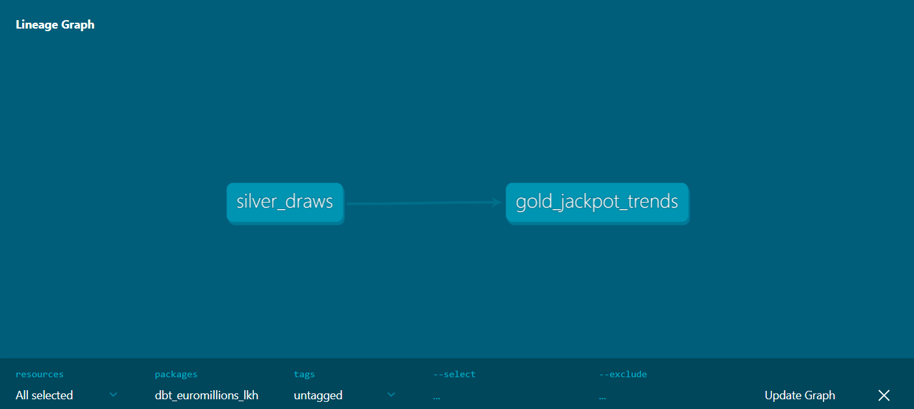
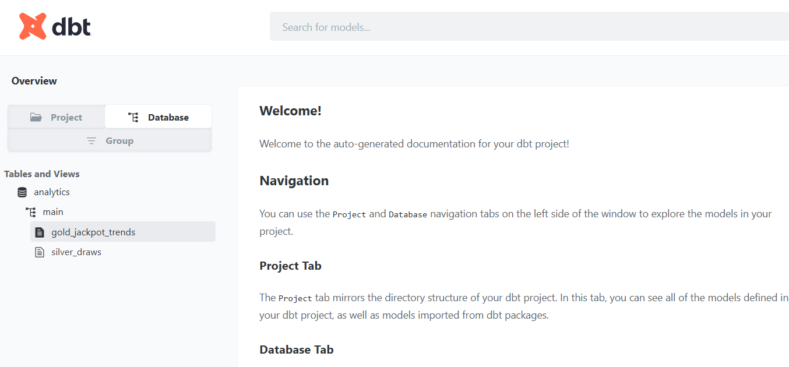
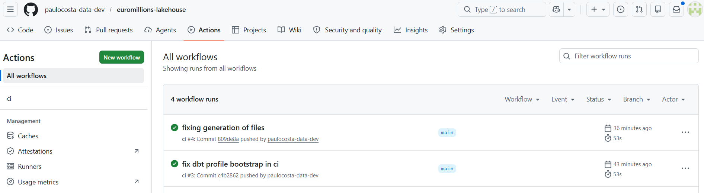

# EuroMillions Lakehouse

A lightweight production-style lakehouse analytics platform built using Apache Iceberg, DuckDB, dbt, Docker, and Python.

The project focuses on modern data engineering architecture, medallion design, ingestion engineering, operational maturity, and architectural trade-offs rather than dashboards, ML gimmicks, or infrastructure inflation.

---

# Objectives

This project was designed to demonstrate practical and modern data engineering capabilities including:

- Apache Iceberg table management
- Lakehouse architecture design
- Medallion modeling
- Incremental ingestion engineering
- Idempotent data pipelines
- dbt transformations and testing
- Analytical data modeling
- Data quality validation
- CI validation workflows
- Containerized reproducibility
- Architectural trade-off reasoning
- Lightweight platform engineering

The goal is not to simulate hyperscale infrastructure.

The goal is to build a coherent, operationally credible, recruiter-grade analytical platform.

---

# Architecture

Detailed architecture documentation:

- [Architecture Overview](docs/architecture.md)

Architecture decisions:

- [ADR-001: DuckDB Over Spark](docs/adr/001-duckdb-over-spark.md)
- [ADR-002: Apache Iceberg](docs/adr/002-why-iceberg.md)
- [ADR-003: Local-First Architecture](docs/adr/003-local-first-architecture.md)
- [ADR-004: No Orchestration Platform](docs/adr/004-no-orchestration-platform.md)

---

# High-Level Architecture

```text
                        ┌─────────────────────────┐
                        │ Historical CSV Dataset  │
                        │ EuroMillions Draws      │
                        └────────────┬────────────┘
                                     │
                                     ▼
                    ┌────────────────────────────────┐
                    │ Python Ingestion Pipeline      │
                    │ ingest_historical_draws.py     │
                    └────────────────┬───────────────┘
                                     │
                                     ▼
                    ┌────────────────────────────────┐
                    │ Apache Iceberg Bronze Layer    │
                    │ bronze.draws_raw               │
                    └────────────────┬───────────────┘
                                     │
                                     ▼
                    ┌────────────────────────────────┐
                    │ DuckDB Serving Layer           │
                    │ raw_bronze_draws               │
                    └────────────────┬───────────────┘
                                     │
                                     ▼
                    ┌────────────────────────────────┐
                    │ dbt Silver Layer               │
                    │ silver_draws                   │
                    └────────────────┬───────────────┘
                                     │
                                     ▼
                    ┌────────────────────────────────┐
                    │ dbt Gold Layer                 │
                    │ gold_jackpot_trends            │
                    └────────────────┬───────────────┘
                                     │
                                     ▼
                    ┌────────────────────────────────┐
                    │ GitHub Actions CI              │
                    │ dbt run + dbt test             │
                    └────────────────────────────────┘
```

---

# Technology Stack

| Layer | Technology |
|---|---|
| Storage abstraction | Apache Iceberg |
| Physical storage | Parquet |
| Metadata catalog | Iceberg SQL catalog |
| Ingestion | Python |
| Serving engine | DuckDB |
| Transformations | dbt |
| Data quality | dbt tests |
| Containerization | Docker |
| CI validation | GitHub Actions |

---

# Medallion Architecture

## Bronze Layer

The bronze layer preserves raw ingestion fidelity.

Responsibilities:

- append-only ingestion
- ingestion metadata
- immutable historical storage
- partitioned lakehouse storage
- minimal transformation logic

Technology:

- Apache Iceberg
- Parquet

---

## Silver Layer

The silver layer provides canonical analytical modeling.

Responsibilities:

- semantic normalization
- business-safe naming
- derived dimensions
- analytical standardization
- data quality enforcement

Technology:

- dbt
- DuckDB

---

## Gold Layer

The gold layer exposes analytical marts optimized for trend analysis and reporting.

Responsibilities:

- aggregations
- trend analytics
- yearly jackpot analysis
- analytical metrics

Technology:

- dbt
- DuckDB

---

# Platform Capabilities

| Capability | Implementation |
|---|---|
| Lakehouse storage | Apache Iceberg |
| Physical storage | Parquet |
| Metadata management | Iceberg catalog |
| Incremental ingestion | Python |
| Idempotent pipelines | yes |
| Analytical serving | DuckDB |
| Transformations | dbt |
| Medallion architecture | bronze / silver / gold |
| Data quality testing | dbt tests |
| CI validation | GitHub Actions |
| Containerization | Docker |
| Local reproducibility | yes |

---

# Incremental Ingestion Design

The ingestion pipeline intentionally supports:

- append-only ingestion
- idempotent execution
- duplicate prevention
- replay-safe ingestion
- partition-aware storage

The pipeline only appends missing draws instead of rebuilding the entire lakehouse state.

This more closely reflects realistic production ingestion behavior.

---

# Why Apache Iceberg

Apache Iceberg was selected to demonstrate:

- modern lakehouse architecture
- snapshot-aware metadata
- partition-aware storage
- schema evolution concepts
- open table standards
- engine interoperability

The project intentionally avoids warehouse-native storage abstractions in favor of open lakehouse standards.

---

# Why DuckDB Instead of Spark

DuckDB was selected because:

- workload size does not justify distributed compute
- local iteration speed is significantly faster
- operational overhead is dramatically lower
- reproducibility becomes simpler
- dbt integration is excellent

The architecture intentionally prioritizes engineering coherence and realistic workload sizing over distributed compute simulation.

---

# Why No Orchestration Platform

Dedicated orchestration tooling was intentionally excluded.

The workload is:

- batch-oriented
- deterministic
- append-only
- low-frequency

Introducing Airflow, Dagster, or Prefect would significantly increase infrastructure complexity without providing proportional engineering value.

The project intentionally avoids architecture theater.

---

# Engineering Trade-Offs

The project intentionally prioritizes:

- lightweight operational design
- local reproducibility
- open table standards
- architectural coherence
- deterministic execution
- realistic workload sizing

Several technologies were intentionally excluded:

| Technology | Reason |
|---|---|
| Spark | workload does not justify distributed compute |
| Airflow | orchestration complexity not required |
| Kubernetes | infrastructure inflation |
| Kafka | no streaming requirement |
| Cloud warehouses | local-first architecture preferred |
| ML / prediction | outside project scope |

The project focuses on engineering maturity rather than infrastructure scale simulation.

---

# Repository Structure

```text
euromillions-lakehouse/
│
├── data/
│   └── raw/
│
├── dbt_euromillions_lkh/
│
├── docs/
│   ├── adr/
│   ├── images/
│   └── architecture.md
│
├── scripts/
│
├── warehouse/
│
├── .github/
│   └── workflows/
│
├── docker-compose.yml
├── Dockerfile
├── requirements.txt
└── README.md
```

---

# Local Development

## Start Platform

```bash
docker compose up -d --build
```

---

## Enter Container

```bash
docker exec -it euromillions-lakehouse bash
```

---

## Run Ingestion

```bash
python scripts/ingest_historical_draws.py
```

---

## Load DuckDB Serving Layer

```bash
python scripts/load_duckdb_analytics.py
```

---

## Run dbt Models

```bash
cd /app/dbt_euromillions_lkh

dbt run
```

---

## Run dbt Tests

```bash
dbt test
```

---

## Generate dbt Documentation

```bash
dbt docs generate
```

---

## Serve dbt Documentation

```bash
dbt docs serve --host 0.0.0.0 --port 8080
```

Then open:

```text
http://localhost:8080
```

---

# CI Validation

GitHub Actions automatically validates:

- Docker build
- ingestion execution
- DuckDB serving layer
- dbt model execution
- dbt tests

The CI pipeline ensures the platform remains reproducible and operationally consistent.

---

# Screenshots

## dbt Lineage



---

## dbt Documentation



---

## GitHub Actions CI



---

# What This Project Demonstrates

This project demonstrates practical experience with:

- modern lakehouse architecture
- Apache Iceberg table management
- medallion data modeling
- incremental ingestion engineering
- idempotent data pipelines
- dbt analytical transformations
- analytical contract validation
- containerized reproducibility
- CI-driven validation
- architectural trade-off analysis
- lightweight platform engineering

The project intentionally emphasizes engineering judgment and operational coherence over unnecessary infrastructure complexity.

---

# Future Improvements

Potential future evolutions include:

- schema evolution simulations
- freshness validation
- late-arriving data handling
- incremental analytical marts
- source-system automation

These were intentionally postponed to avoid unnecessary architectural complexity.

---

# Final Notes

This project intentionally avoids:

- infrastructure inflation
- orchestration theater
- distributed compute simulation
- unnecessary cloud dependencies
- ML gimmicks
- prediction systems

The architecture focuses on:

- engineering discipline
- operational simplicity
- architectural coherence
- realistic analytical platform design
- reproducibility
- maintainability

The objective is to demonstrate strong modern data engineering fundamentals through a lightweight but production-style lakehouse platform.